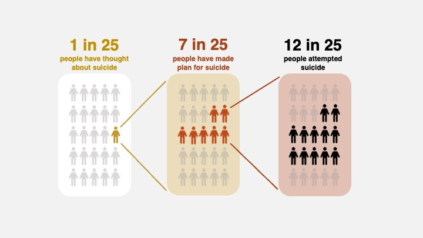

# Outline
This project aims to construct a compelling narrative that delves into the critical issue of suicide prevention. With suicide rates on the rise, this has become a severe societal problem. It's not just about the sadness for families; it incurs economic and social costs, increases healthcare expenses, and contributes to depression in communities.

The project will present statistical evidence, highlighting the alarming suicide rates in the chosen region or country and by demographic categories. Ultimately, the project seeks to persuade policymakers to allocate budget resources to suicide prevention efforts and also enhance the awareness of how important mental health is. It underscores the potential for meaningful change and a brighter future for all.

# Initial sketches

Do you know how many people commit suicide every year?

Did you know that the person next to you might be looking for help?

Many individuals have contemplated suicide and formulated plans for it. Among those who have made such plans, nearly half have attempted suicide.

Over 48,000 people have lost their lives to suicide, which translates to approximately one person taking their own life every 11 minutes.

The number of suicide deaths continues to rise.

Also cost 500 billion in medical costs, work loss costs, value of statistical life, and quality of life costs. 500 billion allows the society to raise 2M children.

Suicide prevention program really can works, here provide Finland successful expereince.

# Data

[CDC](https://www.cdc.gov/suicide/index.html)

[Washington Post](https://www.washingtonpost.com/business/interactive/2022/cost-raising-child-calculator/)

# Method and medium

For my final project, I intend to utilize Shorthand, a multimedia storytelling platform, to craft a compelling and informative page focusing on the critical issue of suicide. This platform offers a rich array of tools and formats, allowing me to integrate text, images, videos, and interactive elements seamlessly. I aim to use these features to present statistical evidence and personal stories that shed light on the alarming rise in suicide statistics and its profound societal impact. By leveraging Shorthand's capabilities, I hope to deliver a narrative that not only raises awareness but also encourages meaningful dialogue and action to address this pressing concern.
