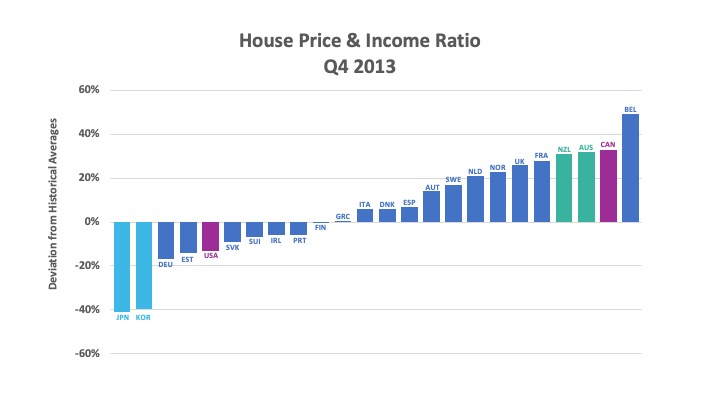
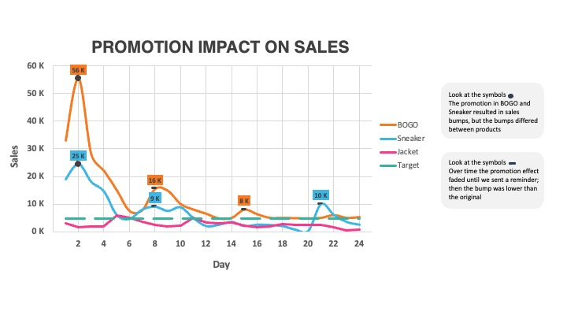
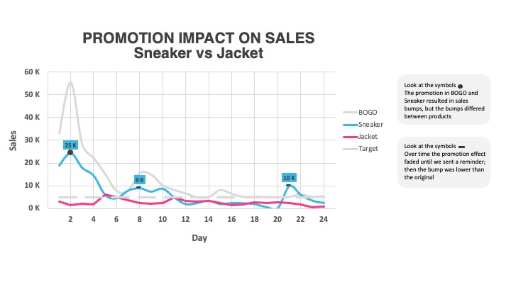
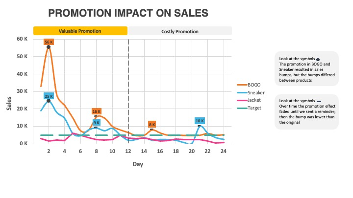

The Simple, Unclear Bar Chart

1. Identify four elements of this chart that contribute to a lack of clarity.

We can't determine the unit of the y-axis, making it difficult to interpret the chart.
It's unclear what the different colors represent as there is no legend on the chart. I assume they differentiate between different continents, so adding a legend on the right side would be helpful.
The plot doesn't clearly display house prices and income as mentioned in the title. The chart needs improvement, and the title should be modified.
If the y-axis represents a calculation, it should be labeled below to provide the formula for readers who may need it.

2. Sketch a new version of it given the following contextual information

The Overdone Line Chart

1. Identify at least two instances of redundancy and say how you'd eliminate them.

We can eliminate the "Day" label on the x-axis, as we have already mentioned it below the x-axis.
The gridlines appear too dense; simplifying the gridlines on x-axis by having them for every other day or every three days and y-axis by having them for every 10k or every 15k would enhancing clarity while maintain the required information for the reader.

2. Identify at least three more elements that make the chart less clear than it could be.

The legend labels 'promo' and 'no promo' are redundant because given that promotions are only in effect on specific days, it's not accurate to describe the entire line as a 'product promo' line, instead, the line graph is mainly represents daily sales. It would be more appropriate to label them with the product names alone, such as 'BOGO,' 'Sneaker,' and 'Jacket.' Additionally, we can rename 'Target sales no promo' to 'Target' for clarity.
The lines connecting to the description column contribute to a cluttered chart. A cleaner approach would be to place these descriptions on the right side of the chart and retain only dots at the promotion points. This way, we can still explain that 'The promotion in BOGO and Sneaker resulted in sales...' and 'The promotions effect in both BOGO and Sneaker faded until..."
We can remove 'over two-plus weeks' from the title since readers can already discern this from the x-axis. We could simply use 'Promotion Impact on Sales' for clarity.
Add label on the promotion days and the day we sent out the reminder, so that people can focus on that data point.

3. Sketch a clearer version that maintains focus on all three variables. Assume that the y-axis refers to dollars. Assume that the promo schedule is as follows:

4. Sketch a version of this chart that focuses clearly on a comparison of sneaker and jacket promotions.

Since we are focusing on Sneaker and Jacket, I will set the rest of the line in grey so that reader can focus on what we want to say.

5.  Sketch a version that shows the valuable promotion period versus the costly promotion period.

Use a line in the middle at 12 days to show the different.

