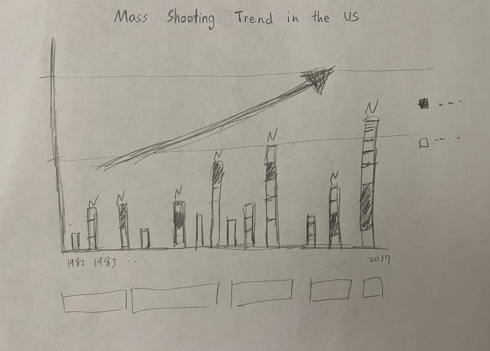
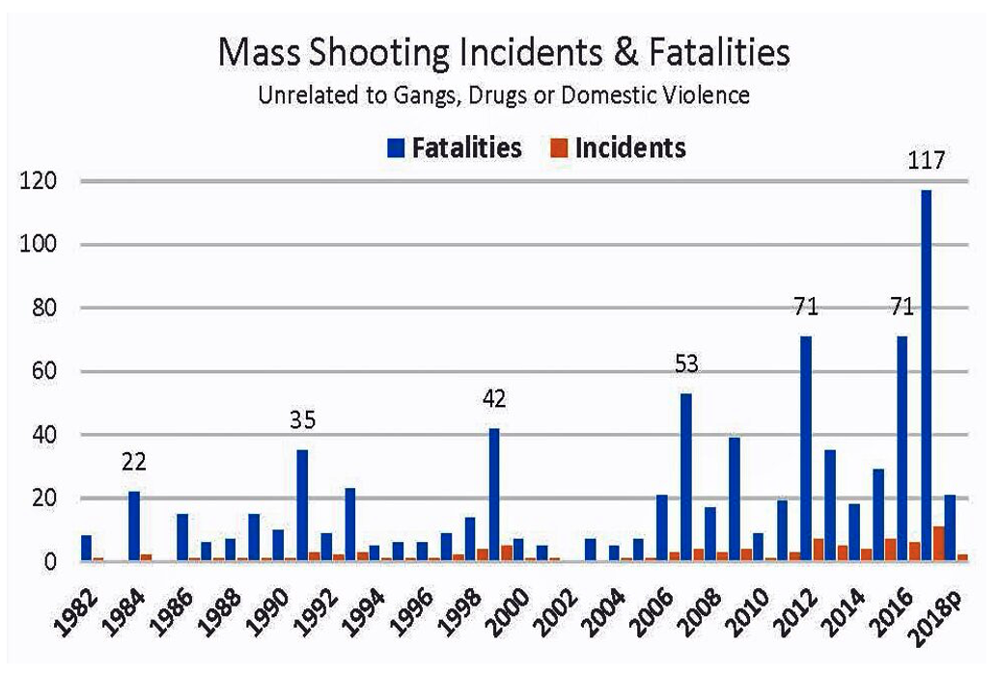
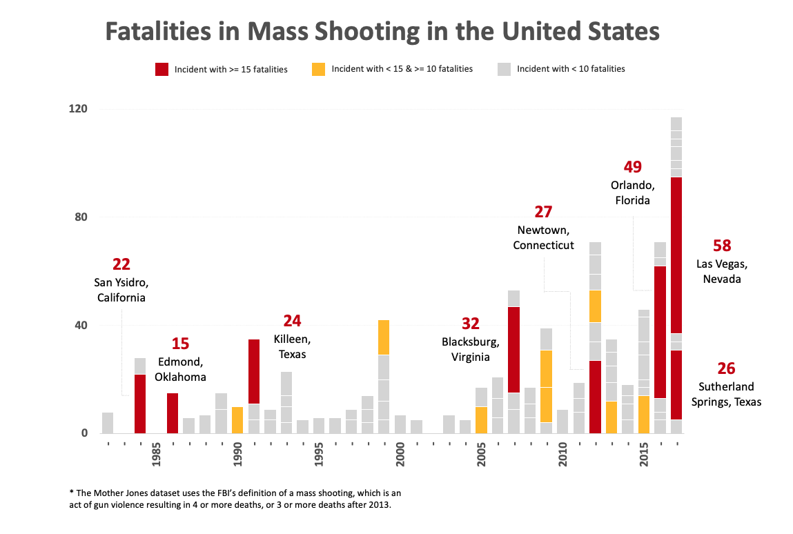

# Assignment 3 & 4: Critique by Design

### Step one: find a data visualization (with data you can use!)

**Data Visualization**
- Data visualization source: CATO Institute
- Data visualization source topic: Are Mass Shootings Becoming More Frequent?
- Data visualization source link: https://www.cato.org/blog/are-mass-shootings-becoming-more-frequent

**Data**
- Data source: Mother Jones
- Data source topic: US Mass Shootings, 1982–2023: Data From Mother Jones’ Investigation
- Data source link: https://www.motherjones.com/politics/2012/12/mass-shootings-mother-jones-full-data/

### Step two: critique the data visualization

** Describe your overall observations about the data visualization here.  What stood out to you?  What did you find worked really well?  What didn't?  What, if anything, would you do differently? **

In this visualization, there are aspects that work effectively. Firstly, it effectively conveys the increasing trend of mass shootings over the years, which is clear and straightforward. Secondly, the chart strategically places labels on certain peaks, drawing viewers' attention to those specific points. Through this emphasis, we can discern trends. However, the chart has room for improvement in two areas. Firstly, since the scale of the number of incidents differs from that of the number of fatalities, it becomes challenging to gauge the magnitude of the increase when both are presented together. It appears as a slight increase, but quantifying it precisely is challenging. I would propose altering the presentation of the incidents and adjusting the color scheme to enhance focus. Additionally, I'd consider providing more detailed information to empower our audience to extract meaningful insights and take informed actions.

** Who is the primary audience for this tool?  Do you think this visualization is effective for reaching that audience?  Why or why not? **

The primary audience for this visualization would be individuals residing in the United States or those considering relocating to the country, seeking insights into the severity of mass shooting incidents over the past few years. Through this visualization, we can readily discern the concerning trend of increasing fatalities occurring approximately every 5 to 8 years. Another potential audience could be government safety department officials, who are interested in understanding the situation and identifying potential areas for improvement. However, for both target groups, the visualization may fall short in providing actionable information.

** Final thoughts: how successful what this method at evaluating the data visualization you selected? Are there measures you feel are missing or not being captured here?  What would you change?  Provide 1-2 recommendations (color, type of visualization, layout, etc.) **

The evaluation method could be enhanced by taking into account the context in which the visualization will be employed. It's crucial to grasp the particular objectives and inquiries the visualization is designed to tackle, as this can guide the refinement of evaluation criteria. As previously mentioned, it's not only about delivering information to the audience but also assisting them in reaching decisions or drawing conclusions. Striking the right balance is key, as an overload of information on the graph can lead to reduced focus, while too little information can render it ineffective.

### Step three: sketch out a solution

### Step four: Test the solution

### Step five: Build your solution

1. A link to the original data visualization (or screenshot - make sure to correctly cite your sources, etc.).  Include paragraph or two on why you selected this particular data visualization.  For obvious reasons, the data visualization you select should come from a publicly accessible source.

**Data Visualization**
- Data visualization source: CATO Institute
- Data visualization source topic: Are Mass Shootings Becoming More Frequent?
- Data visualization source link: https://www.cato.org/blog/are-mass-shootings-becoming-more-frequent

**Data**
- Data source: Mother Jones
- Data source topic: US Mass Shootings, 1982–2023: Data From Mother Jones’ Investigation
- Data source link: https://www.motherjones.com/politics/2012/12/mass-shootings-mother-jones-full-data/

#### Plan and Insight
I select the data on mass shooting fatalities and incidents in the US from Mother Jones is becasue mass shootings are a critical and pressing issue in the United States, with significant social, political, and public safety implications. This is a interesting topix for me and also is crucial for informing policy discussions and public discourse on gun violence. Secondly, Mother Jones is a reputable and well-known source for investigative journalism, therefore, I trust this data. Using data from such a source adds credibility to the information presented in my visualization and ensures that it is based on reliable reporting and research. Furthermore, the data from Mother Jones is publicly accessible, making it an ideal choice for a class project. Publicly available data allows me to share my visualization with a wider audience and encourages transparency and accountability in discussing this critical issue.

The original visualization chart employs blue bars for the number of fatalities and red bars for the number of incidents. However, the incident numbers are relatively lower in comparison to the fatalities. This configuration, with both using the same y-axis, can make it challenging for readers to distinguish between them. While the original chart effectively conveys the rising trend in mass shootings, it doesn't offer many additional insights. Hence, there is room for improvement.

I attempted several approaches to address this issue. First, I explored the option of using a dual Y-axis. Instead of sharing the same Y-axis for both fatalities and incidents, this approach involves having two separate Y-axes on the left and right sides of the chart, each corresponding to a different data series. The intention was to provide a clearer understanding of the scale of each variable and prevent incidents from being obscured by fatalities. However, I encountered challenges with data overlap after adding the second Y-axis, making it harder to interpret.

Secondly, I focused on incorporating annotations and labels to enhance clarity. The idea was to guide the reader's attention to key points. Clear labels and annotations were added to the chart to highlight important trends or specific data points. For example, I considered including annotations for significant events with a high number of fatalities.

Lastly, I explored the possibility of incorporating additional data, such as the locations of these incidents, which is already available in the dataset.

#### Feedback
I got two feedback from friends, they provided valuable insights and we can see how different individuals interpret and perceive my visualization. Here is a summary of their comments and suggestions:

Feedback from the adult friend (late 20's):
My friend accurately grasped the primary purpose of my visualization, recognizing that it effectively communicates the trend of mass shootings in the United States. However, his initial interaction with the chart proved somewhat perplexing, as he initially misconstrued the bars as representing the number of incidents rather than fatalities. This confusion shows that there are some improvement in my visualization. Additionally, he asked about the the bars with a black background, signaling a need for further clarification or differentiation within the visualization by adding some label. In terms of improvement, he recommended altering the title for greater clarity and leveraging color to augment the overall effectiveness of the visualization.

Feedback from the student friend (early 20's):
In the case of my other friend, the feedback she gave demonstrates a keen understanding of my mass shooting data visualization. She correctly identified the chart's purpose, acknowledging that it effectively represents data related to mass shootings in the United States. She successfully discerned the varying shades within the bars, understanding that darker sections signify incidents with more severe injuries. The surprise they expressed at the recurring high peaks in the data highlights an intriguing aspect of the visualization.

Their feedback emphasizes the positive impact of labeling and color, stating that these elements can significantly improved the visualization's clarity, so I should take good care of it for my redesign. Overall, the insights provided by both friends underscore the significance of clarity, labeling, and color in making the information more accessible and comprehensible to a diverse audience, ultimately assisting myself in refining my visualization to effectively convey its intended message.

#### Redesign

Based on the feedback and insights gathered, I have made several improvements to the visualization:

- Chart Type: I have redesigned the visualization from a bar chart to a stacked bar chart to better represent the relationship between incidents and fatalities over time.
- Color Coding: I added a color scheme to make the data more visually intuitive. Incidents with over 15 fatalities are now highlighted in red, incidents with less than 15 but more than 10 fatalities are shown in yellow, and incidents with fewer than 10 fatalities are depicted in grey.
- Labeling: I incorporated labels for incidents with over 15 fatalities, providing the number of fatalities and the location of the incident. This additional information adds context and clarity.
- Title: I changed the title to "Fatalities in Mass Shootings in the United States" to make it explicitly clear that the visualization focuses on fatalities rather than injuries.
- Y-Axis: I reduced the number of lines on the y-axis to simplify the plot and make it more visually appealing. This minimizes clutter and improves overall readability.
- Year Intervals: I opted to display the years at five-year intervals, preventing the years from clustering together and making it easier for viewers to identify trends over time.

These changes aim to enhance the effectiveness of my visualization, ensuring that it is more user-friendly, informative, and visually appealing while addressing the feedback provided by friends.
